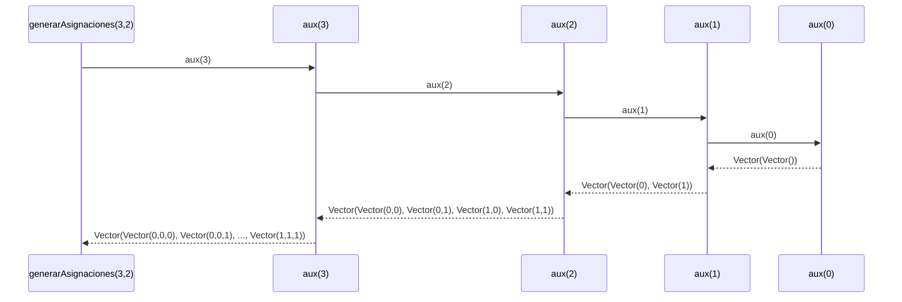

# Informe de Proceso

## `generarAsignaciones` con recursión lineal

### Definición del algoritmo

```scala
def generarAsignaciones(n: Int, m: Int): Vector[Asignacion] = {
  def aux(k: Int): Vector[Asignacion] =
    if (k == 0) Vector(Vector.empty)
    else
      aux(k - 1).flatMap { resto =>
        (0 until m).toVector.map(aula => resto :+ aula)
      }
  aux(n)
}
```

- La función `generarAsignaciones` genera todas las asignaciones posibles para
  `n` cursos y `m` aulas, es decir, todos los vectores en $\{0, \ldots, m-1\}^n$.
- La función interna `aux` es la que hace la recursión:
  - Recibe un parámetro `k`: el número de cursos para los que se generan asignaciones
    en ese momento.
  - Construye las asignaciones de longitud `k` a partir de las de longitud `k-1`.

---

### Explicación paso a paso

#### Caso base

```scala
if (k == 0) Vector(Vector.empty)
```

Cuando `k` llega a `0` no hay cursos que asignar, por lo que existe exactamente
una asignación posible: la asignación vacía. Se devuelve un vector que contiene
un solo elemento: el vector vacío.

#### Caso recursivo

```scala
aux(k - 1).flatMap { resto =>
  (0 until m).toVector.map(aula => resto :+ aula)
}
```

En cada llamada:

- Se llama a `aux(k-1)` para obtener todas las asignaciones de longitud `k-1`.
- Para cada asignación parcial `resto` se agregan todas las aulas posibles
  $\{0, \ldots, m-1\}$ al final con `:+`, generando `m` nuevas asignaciones
  de longitud `k`.
- `flatMap` aplana todos los resultados en un solo vector plano.

---

### Llamados de pila

Ejemplo con $n = 3$ cursos y $m = 2$ aulas:

```scala
generarAsignaciones(3, 2)
```

#### Paso 1: Llamada inicial

```scala
aux(3)
```

#### Paso 2: Primera llamada recursiva

```scala
aux(2)
```

#### Paso 3: Segunda llamada recursiva

```scala
aux(1)
```

#### Paso 4: Tercera llamada recursiva — caso base

```scala
aux(0) → Vector(Vector())
```

#### Paso 5: Retorno a `aux(1)`

```scala
Vector(Vector()).flatMap { resto =>
  Vector(0, 1).map(aula => resto :+ aula)
}
→ Vector(Vector(0), Vector(1))
```

#### Paso 6: Retorno a `aux(2)`

```scala
Vector(Vector(0), Vector(1)).flatMap { resto =>
  Vector(0, 1).map(aula => resto :+ aula)
}
→ Vector(Vector(0,0), Vector(0,1), Vector(1,0), Vector(1,1))
```

#### Paso 7: Retorno a `aux(3)`

```scala
Vector(Vector(0,0), Vector(0,1), Vector(1,0), Vector(1,1)).flatMap { resto =>
  Vector(0, 1).map(aula => resto :+ aula)
}
→ Vector(
    Vector(0,0,0), Vector(0,0,1),
    Vector(0,1,0), Vector(0,1,1),
    Vector(1,0,0), Vector(1,0,1),
    Vector(1,1,0), Vector(1,1,1)
  )
```

El resultado final son $2^3 = 8$ asignaciones posibles.

---

### Diagrama de llamados de pila



---

### Diferencia con recursión de cola

- En **recursión de cola** cada llamada reemplaza a la anterior en la pila porque
  la llamada recursiva es la última instrucción. No se acumulan llamados.
- En `generarAsignaciones` la recursión **no es de cola** porque después de llamar
  a `aux(k-1)` todavía se aplica `flatMap` sobre el resultado. Cada llamada queda
  en la pila esperando el resultado de la anterior para poder continuar.
- Esto significa que para $n$ cursos se acumulan $n+1$ llamados en la pila antes
  de empezar a resolverlos. Por eso el profe limita $n \leq 8$ para mantener el
  espacio de búsqueda tratable.

---

### Ejemplo de uso

```scala
val asignaciones = generarAsignaciones(3, 2)
// Vector(
//   Vector(0,0,0), Vector(0,0,1),
//   Vector(0,1,0), Vector(0,1,1),
//   Vector(1,0,0), Vector(1,0,1),
//   Vector(1,1,0), Vector(1,1,1)
// )
```

El resultado de `generarAsignaciones(3, 2)` son $2^3 = 8$ asignaciones posibles.